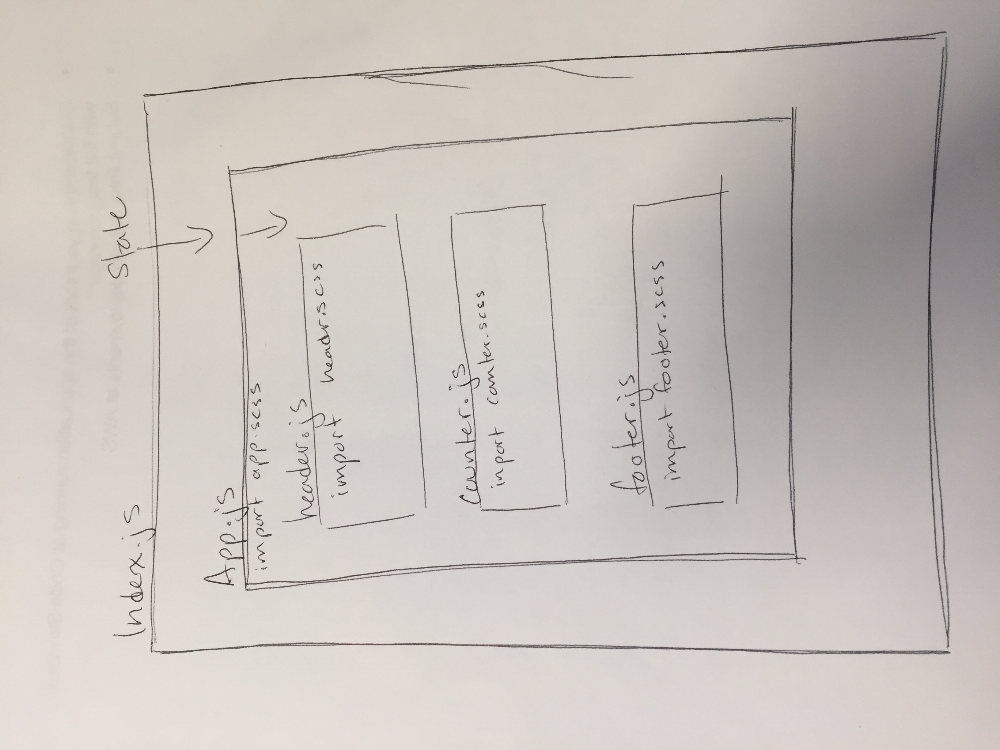

# React Testing and Deployment

##### Author: Hannah Ingham

[AWS site](http://hi-react-testing.s3-website-us-west-2.amazonaws.com/)

### Modules:
* counter.js
* footer.js
* header.js
* app.js

### Description
Style the site. Write tests to check if the click link works correctly. Deploy the site to AWS.

### Deployment to AWS
Create a new bucket. Drop files into the bucket. Make the bucket public to everyone. Set up the static with with index.html. Click the link provided to check that the site rendered properly. 

### Test
* `npm test`
* Assertions: clicking on link triggers - 

### uml

